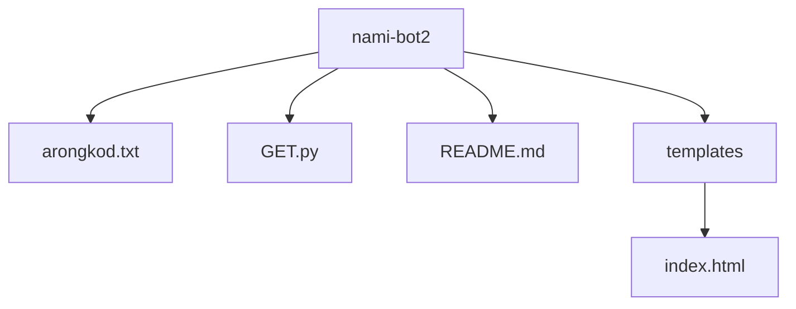

# nami-bot2


## Overview
nami-bot2 is a Flask-based web application that allows users to chat with a bot. The bot is powered by OpenAI's GPT-3.5-turbo model and role-plays as Nami from One Piece.

## Features
- Chat with a bot that role-plays as Nami from One Piece.
- Simple and clean user interface.
- Powered by OpenAI's GPT-3.5-turbo model.

## Installation
1. Clone the repository:
    ```sh
    git clone https://github.com/yourusername/nami-bot2.git
    cd nami-bot2
    ```

2. Create a virtual environment and activate it:
    ```sh
    python -m venv venv
    source venv/bin/activate  # On Windows use `venv\Scripts\activate`
    ```

3. Install the required packages:
    ```sh
    pip install -r requirements.txt
    ```

4. Set your OpenAI API key in [GET.py](http://_vscodecontentref_/1):
    ```python
    openai.api_key = 'your-openai-api-key'
    ```

## Usage
1. Run the  applicationFlask:
    ```sh
    python GET.py
    ```

2. Open your web browser and go to `http://127.0.0.1:5000/`.

3. Type your message in the input box and click "Send" to chat with the bot.

## File Structure

This adds a section to your README explaining the GitHub Actions workflow for automating testing and deployment.
This adds a section to your README explaining the GitHub Actions workflow for automating testing and deployment.
name: Deploy Flask App

on:
  push:
    branches:
      - main

jobs:
  build:
    runs-on: ubuntu-latest

    steps:
    - name: Checkout code
      uses: actions/checkout@v2

    - name: Set up Python
      uses: actions/setup-python@v2
      with:
        python-version: '3.8'

    - name: Install dependencies
      run: |
        python -m venv venv
        source venv/bin/activate
        pip install -r requirements.txt

    - name: Run tests
      run: |
        source venv/bin/activate
        pytest

  deploy:
    runs-on: ubuntu-latest
    needs: build

    steps:
    - name: Checkout code
      uses: actions/checkout@v2

    - name: Set up Python
      uses: actions/setup-python@v2
      with:
        python-version: '3.8'

    - name: Install dependencies
      run: |
        python -m venv venv
        source venv/bin/activate
        pip install -r requirements.txt

    - name: Deploy to Heroku
      env:
        HEROKU_API_KEY: ${{ secrets.HEROKU_API_KEY }}
      run: |
        source venv/bin/activate
        pip install gunicorn
        heroku create
        git push heroku main
